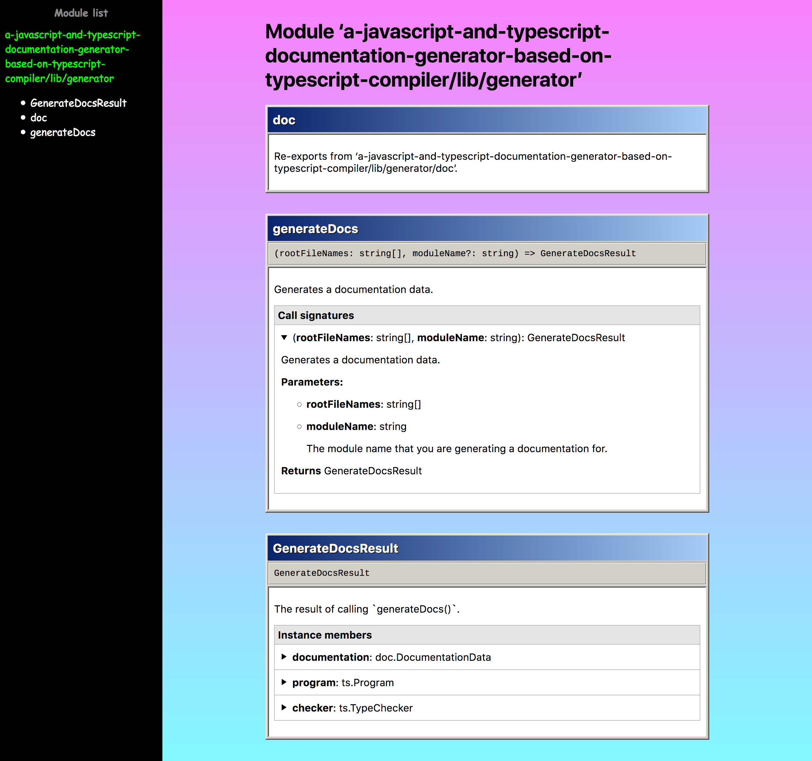
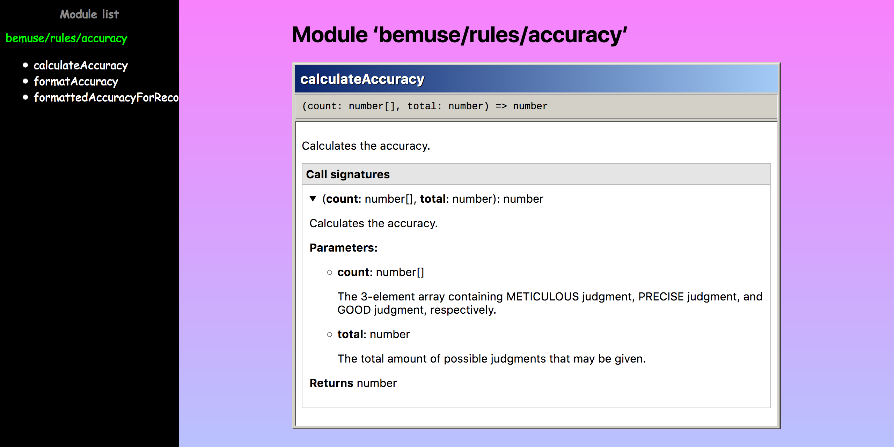

# a-javascript-and-typescript-documentation-generator-based-on-typescript-compiler

**A documentation generator that understands ES modules and infers types.**
It is powered by the TypeScript compiler, which also powers the [JavaScript and TypeScript IntelliSense](https://github.com/Microsoft/TypeScript/wiki/JavaScript-Language-Service-in-Visual-Studio#TypeInference).

This means your documented code will be picked up by IDEs
(such as Visual Studio, VS Code, or Atom-IDE) to provide auto-completions the same way!


Instead of “looking for functions/variables/constants/classes declared in a file,”
it looks at each public module and walks through each exported symbol.
This means it understands modules that re-exports things like this:

```js
// index.ts
import * as doc from './doc'

export { doc }
export { default as generateDocs, GenerateDocsResult } from './generateDocs'
```

And generates a documentation like this:



It also works with JavaScript file. In this case, [TypeScript compiler reads the type annotation from JSDog tags](https://github.com/Microsoft/TypeScript/wiki/JSDoc-support-in-JavaScript).

```js
/**
 * Calculates the accuracy.
 * @param {number[]} count The 3-element array containing METICULOUS judgment,
 * PRECISE judgment, and GOOD judgment, respectively.
 * @param {number} total The total amount of possible judgments that may be given.
 * @returns the accuracy number, from 0 to 1
 */
export function calculateAccuracy (count, total) {
  return (count[0] + count[1] * 0.8 + count[2] * 0.5) / total
}
```

Which generates a documentation like this
(note: the return type is inferred by the compiler):



<p align="center">
  :construction: :construction: :construction:
  <strong>This project is under construction!</strong>
  :construction: :construction: :construction:
</p>

## Inspiration

  - Visual Studio’s JavaScript IntelliSense (based on TypeScript) is very smart.
    It is based on TypeScript’s Language Service.
    However, most current documentation tools don’t benefit from that smart-ness.

  - Most tools don’t infer type from source code and only reads the JSDoc tags.

  - Some tools requires you to specify types and documentation in a proprietary format,
    which is not compatible with the IntelliSense.

  - The thing I found closest to what I want is [TypeDoc](https://github.com/TypeStrong/typedoc).
    It does use TypeScript compiler,
    but processes modules by walking through the AST,
    instead of looking at all exported symbols of a module
    (e.g. using TypeScript’s `getExportsOfModule()`).

  - Many projects has an `index.js` file
    which only re-exports things from other modules
    (e.g. `export { createStore } from './createStore'`).
    However, [TypeDoc does not support it yet](https://github.com/TypeStrong/typedoc/issues/596).

  - I don’t want to document a file;
    I want to document my __module’s API surface area.__

    > Given that I import a module, what is there for me to use?

  - VS Code’s IntelliSense tries its best to understand your code and infer stuff,
    instead of forcing you to document everything in its own syntax.
    Documentation generator tools should do the same!

  - **The plan:** Learn how TypeScript Language Service achieves that smartness,
    then create a documentation generator (loosely) based on that knowledge.


## Process

```
                `ts.createProgram()`
                        |
+-------------------+   |   +--------------------+
|    Input files    | ----> | TypeScript program |
| (.js, .ts, .d.ts) |       |   (`ts.Program`)   |
+-------------------+       +--------------------+
                                | walk the modules and symbols
                                V
     +-----------------------------------------+
     | Documentation model (JSON-serializable) |
     +-----------------------------------------+
         | generate             | export
         V                      V
     +-------------------+   +---------------+
     | Web pages (.html) |   | Model (.json) |
     +-------------------+   +---------------+
```

  - Input files are fed into TypeScript compilers, which will resolve all
    modules, infer types, and lots of super-cool stuff.
    It results in a **ts.Program** object.

  - a-javascript-and-typescript-documentation-generator-based-on-typescript-compiler
    goes through the modules, and collect documentation data, into a JSON-serializable model.

  - Then we can generate a web page / readme file / whatever out of it!


## Usage

**Warning:**
This is still in development, and it might not work well.
Please be prepared to dive into the source code.

Installation:

```
yarn global add a-javascript-and-typescript-documentation-generator-based-on-typescript-compiler
```

Generate HTML documentation:

```
a-javascript-and-typescript-documentation-generator-based-on-typescript-compiler src/index.js --html docs/api
```

Generate JSON to stdout:

```
a-javascript-and-typescript-documentation-generator-based-on-typescript-compiler src/index.js --json docs/api.json
```

JSON model is defined at [src/generator/doc.ts](src/generator/doc.ts).


## development

1.  Clone this project.

2.  Install the dependencies:

    ```
    yarn
    ```

3.  To generate a documentation JSON:

    ```
    yarn dev:generate <inputfile.ts ...>
    ```

4.  To view and develop the documentation web page:

    ```
    ./node_modules/.bin/ts-node --doc.input=<inputfile.ts>
    ```
